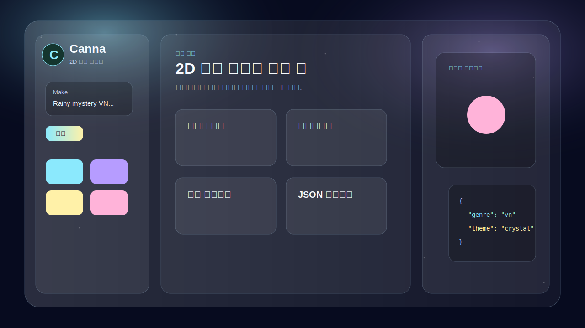

# Canna Studio

**Canna Studio** is a browser-based prototype for a 2D genre-focused vibe coding tool.

It turns a short game idea into editable 2D game structures: visual novels, roguelikes, RPGs, platformers, puzzles, card games, rhythm games, life sims, and more.

## Try It

Open `index.html` in a browser.

When GitHub Pages is enabled for this repository, the app can be served from:

https://sihoo101209-ctrl.github.io/canna/

## Features

- Natural-language **Make** prompt for creating 2D game drafts
- Game seed remixing across genres
- 12 genre templates
- Feature atlas for story, combat, maps, quests, accessibility, export, workflow, and community ideas
- 12 abstract visual themes inspired by glassy dark UI palettes
- Local JSON export/import
- Browser `localStorage` saving
- Roguelike tile editing prototype
- Live preview panel
- Static sample game export in `examples/rainy-doll-vn.html`

## Genre Templates

- Visual Novel
- Roguelike
- Top-down RPG
- Platformer
- Puzzle
- Card / Deckbuilder
- Shooter
- Rhythm
- Life Sim
- Idle RPG
- Metroidvania
- Point & Click Adventure

## Project Status

This is an early prototype. The current AI-like generation is local and rules-based. A future version can connect to an AI API through a small provider layer.

See [docs/ROADMAP.md](./docs/ROADMAP.md) for planned work.

## Files

- `index.html` - main app shell
- `styles.css` - responsive glassy UI and 12 theme system
- `script.js` - genre data, Make prompt, theme switching, preview, JSON export/import
- `examples/rainy-doll-vn.html` - tiny playable visual novel sample
- `.github/workflows/pages.yml` - GitHub Pages deployment workflow

## License

MIT License. See [LICENSE](./LICENSE).
